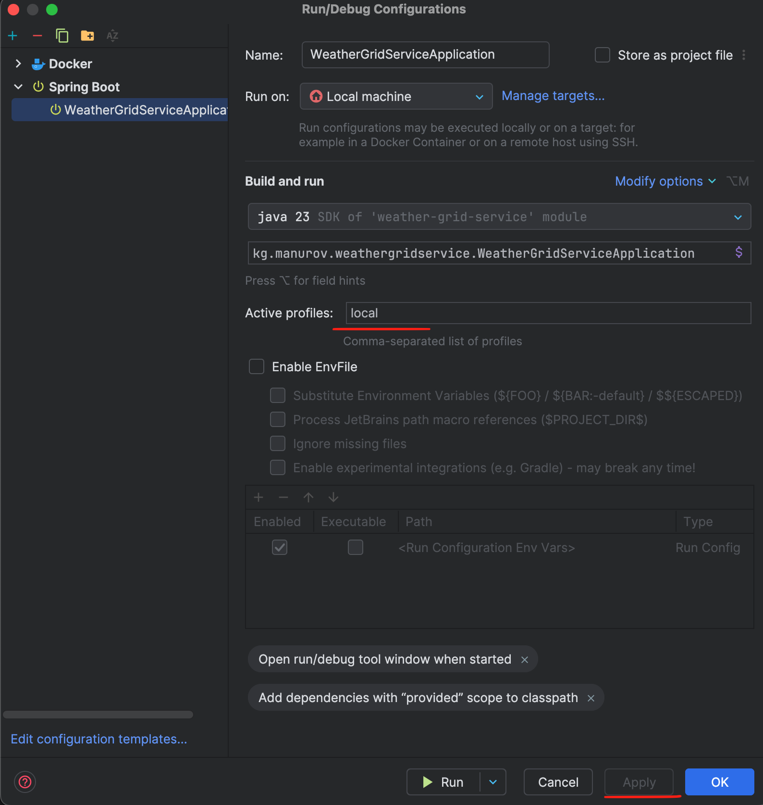

# Weather Grid Service

ссылка на техническое
задание: https://docs.google.com/document/d/1BtmVY7XE2uyYn0LgYnYrk2yEIpmrZ3tcUnX_hrOz9C8/edit?usp=sharing

## Описание проекта

Weather Grid Service — это REST API-сервис, предназначенный для получения, хранения и кэширования погодных данных на
основе регулярной географической сетки. Система разработана для агросегментационных задач и использует внешнее погодное
API (Open-Meteo) с привязкой к координатной сетке, а не к конкретным полям.

### Функционал проекта:

1. **Добавление пользователя в систему:**
    - Добавление пользователя с параметром: Имя

2. **Добавления полей в систему:**
    - Добавление поля с характеристиками:
        - Долгота, широта, тип орошения и урожая, наименования поля, размер участка(hA), углеводы

3. **Получение прогноза погоды:**
    - Прогноз погоды по координатам поля запрашивается с помощью Open-Meteo API
    - Прогноз кэшируется в Redis
    - Параметры прогноза: температура, осадки, влажность, давление, облачность, скорость и направление ветра, снежный покров и др.

4. **Автоматическое и ручное заполнение истории:**
    - История погоды сохраняется в БД (weather_daily_history) по каждому узлу сетки к которым привязаны поля.
    - Поддерживается ручной вызов эндпоинта и автоматическое обновление по расписанию через @Scheduled

5. **Журналирование и логирование:**
    - Все создания записей записываются в журнал через **Slf4j** от Lombok. 
    - Логи сохраняются в файл.

6. **API:**
    - REST API реализовано для всех действий, с подробной документацией через Swagger.

## Стек технологий:

- Java 21
- Spring Boot
- Spring Data JPA
- Redis
- MapStruct
- PostgresSQL
- PostGIS
- JTS
- Spring WebFlux
- Docker
- Lombok
- Liquibase (для миграций)
- Leaflet
- Open-Meteo API
- Maven

## План выполненных задач:

### Миграции

- Созданы таблицы для:
    - weather_locations, users, fields, weather_daily_history, country_boundaries.

### Реализация сущностей и репозиториев

- Созданы модели и репозитории для:
    - weatherLocations, users, fields, weatherDailyHistory & weatherDailyHistoryId(@Embeddable).

### Конфигурация

- **Redis:** используется для кэширования данных прогноза погоды по узлам сетки. Позволяет значительно снизить
  количество обращений к внешнему API Open-Meteo. Ключи формируются по шаблону forecast:loc_ID_{id}, время жизни кэша (TTL) — от 1 до 3 часов.
- **Slf4j:** Логирование всех действий через Lombok Slf4j.
- **ScheduledConfig:** Для активации планировщика создании записей.
- **GlobalExceptionHandler:** Исключения обрабатываются централизованно для каждой сущности.

### Валидация данных

- Все DTO, принимаемые через POST и PUT запросы, проходят валидацию на корректность. Дополнительно для класса FieldDto
  реализована кастомная аннотация для проверки некоторых константных значений.

### Не до паттерн "Синглтон" & "фабричный" для проверки константных значений

- Реализована логика на основе паттернов "Синглтон" & "фабричный" для проверки различных данных (пол, активность и цель
  пользователя и др...).

### Функциональность

- Регистрация пользователей и создание полей с привязкой пользователей.
- Управление ресурсами (CRUD).
- Ручное добавление записей(истории) локации привязанные к полям.
- Автоматическое добавление записей(истории) у локации привязанные к полю.
- Чтение и проверка нормы прогнозы погод у локаций.

## Особенности проекта:

- **Кэширование реактивных объектов:** благодаря Spring Cache и Redis, погодные данные, полученные через WebClient, кэшируются в реактивной среде, что уменьшает задержки и количество внешних запросов.
- **Redis:** используется для временного хранения прогноза погоды по каждому узлу сетки. Позволяет существенно снизить нагрузку на Open-Meteo API. Ключи формируются динамически, с TTL от 1 до 3 часов.
- **PostGIS:** расширение PostgreSQL для работы с географическими данными. Используется для хранения геометрий, выполнения пространственных запросов и привязки полей к ближайшим узлам погодной сетки.
- **Leflet:** используется для визуализации сетки, полей и погодных точек на карте во фронтенд-части приложения.
- **Плановое добавление данных:** АвтомАвтоматическоеатическое добавление и расчет данных в БД с помощью аннотации
  _@Scheduled_.
- **Кастомные валидации:** Реализованы отдельные валидаторы, чтобы вынести бизнес-валидации за пределы сервисного слоя.
- **MapStruct**: Интегрирован MapStruct для удобной и быстрой конвертации между сущностями и DTO.
- **Docker**: Проект и база данных запускаются в Docker-окружении с использованием Docker Compose для удобства
  развертывания и управления контейнерами.
- **Профилирование окружений(`application-local`, `application-prod`):** используется механизм Spring Profiles для разделения конфигураций разработки и продакшена. Настройки окружения (базы данных, Redis, логгирование, планировщики и т.д.) подгружаются в зависимости от активного профиля.

### Запуск проекта:

1. Клонируйте репозиторий.
2. чтобы запустить локально настройте Run/Debug Configurations: 
3. Запустите приложение в Docker с использованием Docker Compose: `docker compose up --build`
4. Используйте Postman для тестирования API.

### Postman Collection:

Коллекция для тестирования API доступна в проекте(в папке _resources_) и может быть импортирована в Postman для
демонстрации функциональности.

